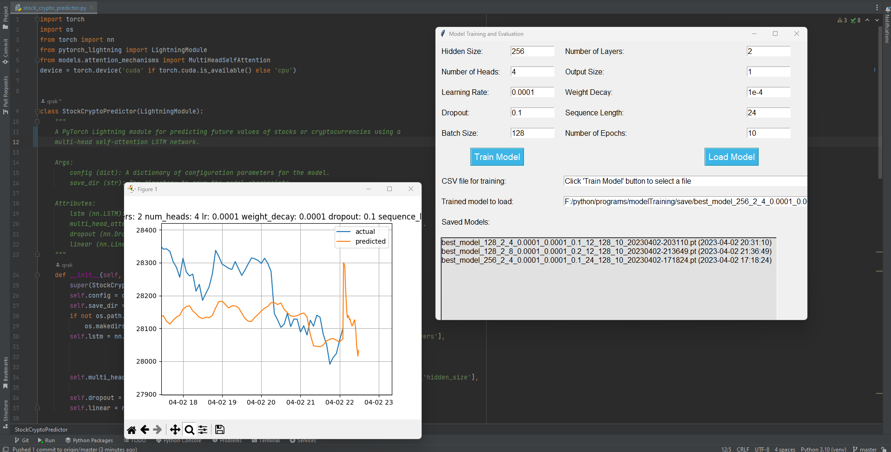

# Neural Network Training in Python

This repository contains code for training neural networks on various datasets. 


## Usage

### LSTM GUI

The main_gui.py script creates a simple GUI application using the tkinter library that allows users to train and evaluate a Bitcoin price predictor model. The script uses two main classes, ModelTrainer and ModelLoader, to handle the training and evaluation of the model, respectively.

The GUI application provides two buttons, "Train Model" and "Load Model," that allow the user to either train a new model or load a previously trained model. When the user clicks the "Train Model" button, a file dialog box is displayed that allows the user to select a CSV file containing the training data. The file path of the selected file is then displayed in a text entry box. The selected data is then preprocessed, split into training and testing sets, and used to train the model using the ModelTrainer class. The trained model is then saved to a file, and the ModelTrainer class is used to test and evaluate the model.

When the user clicks the "Load Model" button, a file dialog box is displayed that allows the user to select a previously saved model file. The file path of the selected file is then displayed in a text entry box. The ModelLoader class is used to fetch live data from a Bitcoin price API, preprocess the data, and configure the model using the same parameters as those used during training. The saved model is then loaded from the selected file, and the ModelLoader class is used to evaluate the performance of the model on the live data.
### LSTM Model

The lstm_model.py script contains a PyTorch implementation of a Bitcoin price predictor using a multi-head self-attention mechanism and a bidirectional LSTM network. The model is defined as a PyTorch Lightning Module, which provides a high-level abstraction for training and evaluating PyTorch models.

The model architecture consists of an LSTM layer with bidirectional processing, followed by a multi-head self-attention layer, a dropout layer, and a linear output layer. The self-attention layer allows the model to learn contextual relationships between different time steps in the input sequence, which can help to improve the accuracy of the model's predictions.

The forward method of the model takes a batch of input sequences as input and returns a batch of predicted Bitcoin prices. The mean_absolute_percentage_error method is used to calculate the mean absolute percentage error between the predicted and true Bitcoin prices, and the calculate_loss method calculates the mean squared error loss between the predicted and true prices.

The model is trained using the training_step method, which calculates the loss and mean absolute percentage error for a batch of training data and logs the values to the training metrics. The validation_step and test_step methods perform similar calculations for the validation and test datasets, respectively.

The configure_optimizers method sets up the Adam optimizer with a specified learning rate and weight decay, as well as a learning rate scheduler that reduces the learning rate by a factor of 0.5 when the validation loss plateaus for 5 epochs. The monitor parameter specifies that the scheduler should monitor the validation loss for scheduling the learning rate updates.

Overall, this script provides a comprehensive implementation of a Bitcoin price predictor using PyTorch and PyTorch Lightning, which can be trained and evaluated using a variety of datasets
### Candle Downloader

The `candledownloader.py` module can be used to download candlestick data from the Binance exchange using the CCXT library. The downloaded data is stored in a CSV file. The script takes several parameters such as the exchange name, trading pair, timeframe, start and end time, batch size, and output file name. If no output file name is provided, the script generates a default name based on the specified parameters.

### Indicators Adder

The `indicatorsadder.py` module loads historical price data for Bitcoin on the Binance exchange, calculates various technical indicators (EMA, RSI, Bollinger Bands, CCI, ADX), and pivot points. It then saves the data, including the calculated indicators and pivots, to a CSV file for further analysis.

### Indicators Checker

The `indicatorschecker.py` module loads a CSV file containing Bitcoin price data and technical indicators, checks for missing or infinite values, and drops columns with NaN values. The script first prints the column names and then uses NumPy to check for infinite values in the data. It then counts the number of NaN values and prints the rows and columns that contain NaN values. Finally, the script drops columns with NaN values and saves the resulting dataframe to a new CSV file.

## Installation

Clone the repository:

```bash
git clone https://github.com/qrak/neural-network-training.git
cd neural-network-training

```
Create a virtual environment and install the dependencies:

```bash
python3 -m venv env
source env/bin/activate
pip install -r requirements.txt
```
